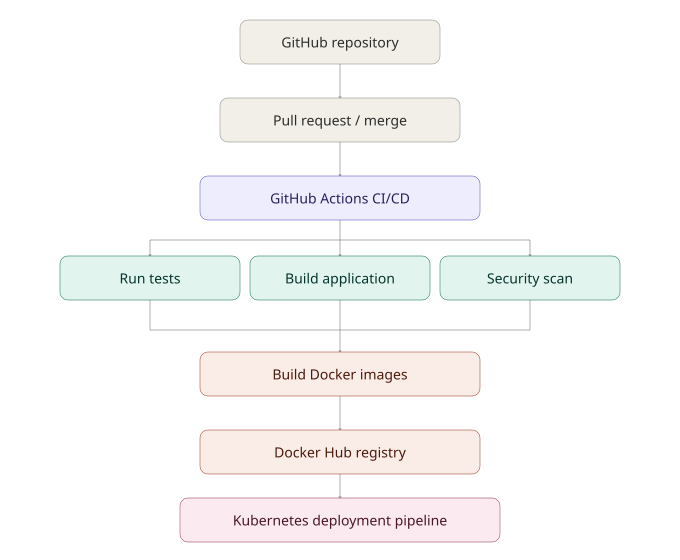
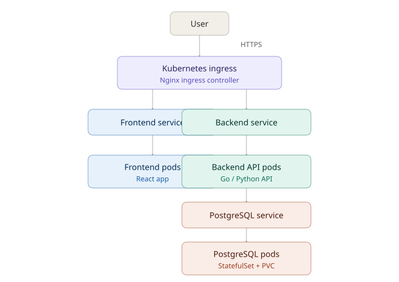
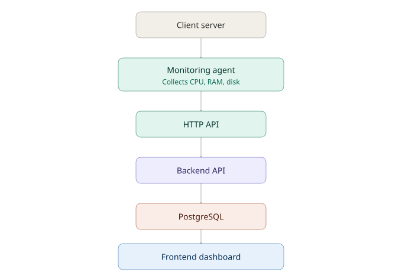
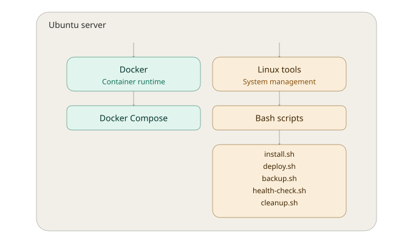

# Architecture

This document describes how `devops-monitoring-platform` is built, shipped, and run —
from a developer's laptop to a Kubernetes cluster. For AI-agent-facing conventions and
commands, see [`AGENTS.md`](../AGENTS.md) at the repo root.

## Overview

A user opens the web dashboard, sees their registered servers, and sees each server's
CPU, RAM, disk, and health status. That data gets there through a lightweight agent
installed on each monitored server, a Go backend API, and a PostgreSQL database.

## 1. CI/CD pipeline

Code moves from a developer's machine to a running deployment through GitHub Actions:
tests, an application build, and a security scan run in parallel, then the pipeline
builds Docker images, pushes them to Docker Hub, and deploys to Kubernetes.

## 2. Kubernetes cluster topology

In production, a user's request enters through the Kubernetes Ingress and the Nginx
Ingress Controller, which routes to either the frontend or backend Service. Those
forward to their respective Pods; backend Pods talk to a PostgreSQL Service backed by
a StatefulSet with a PersistentVolumeClaim.

**Resource types used per layer:**

| Layer | Resources |
|---|---|
| Networking | Namespace, Ingress, Nginx Ingress Controller, Service (ClusterIP / LoadBalancer / NodePort) |
| Frontend | Deployment, ReplicaSet, Pods, Service |
| Backend | Deployment, ReplicaSet, Pods, Service |
| Database | StatefulSet, Pods, Service, PersistentVolume, PersistentVolumeClaim |
| Configuration | ConfigMap, Secret |
| Security | Namespace isolation, Secret management, RBAC (ServiceAccount, Role, RoleBinding), Trivy, SonarQube |
| App management | Helm Chart, `values.yaml` |
| Automation | Job, CronJob (DB backups, cleanup tasks) |

## 3. Server monitoring flow

Each monitored machine runs a monitoring agent that collects CPU, RAM, and disk usage
and reports it over HTTP to the backend API, which persists it in PostgreSQL and
serves it back out to the frontend dashboard.

## 4. Local development environment

Before deploying to Kubernetes, the full stack runs locally with Docker Compose: an
Nginx container fronts the frontend and backend services, and the backend connects to
a local PostgreSQL container. Started with a single `docker compose up`.

## 5. Production server layout (single-VPS deployment)

This is the **Linux VPS the app actually runs on 24/7** (e.g. a DigitalOcean Droplet
or AWS EC2 instance) — not the developer's laptop from section 4, and not a Kubernetes
node from section 2. It needs to stay online and reachable by a public IP so the
monitoring agents on other servers and end users can both reach it.

On that Ubuntu VPS, two things run side by side:
- **Docker**, via Docker Compose — runs the containerized app (frontend, backend, postgres, nginx). Same containers as local dev, just running permanently on a public server instead of a laptop.
- **Bash scripts** (`scripts/`) — run directly on the OS, *outside* any container, for tasks that need direct system access: `install.sh`, `deploy.sh`, `backup.sh`, `health-check.sh`, `cleanup.sh`.

This is the simpler, non-Kubernetes deployment path. Once the project moves to the
Kubernetes setup in section 2, each node still runs a container runtime under the hood
(typically containerd, not Docker itself — Kubernetes dropped direct Docker support in
v1.24), but Compose and these scripts are replaced by `kubectl`/Helm — the cluster
manages containers for you.

## See also

- [`AGENTS.md`](../AGENTS.md) — conventions, structure, and best practices for humans and AI agents working in this repo.